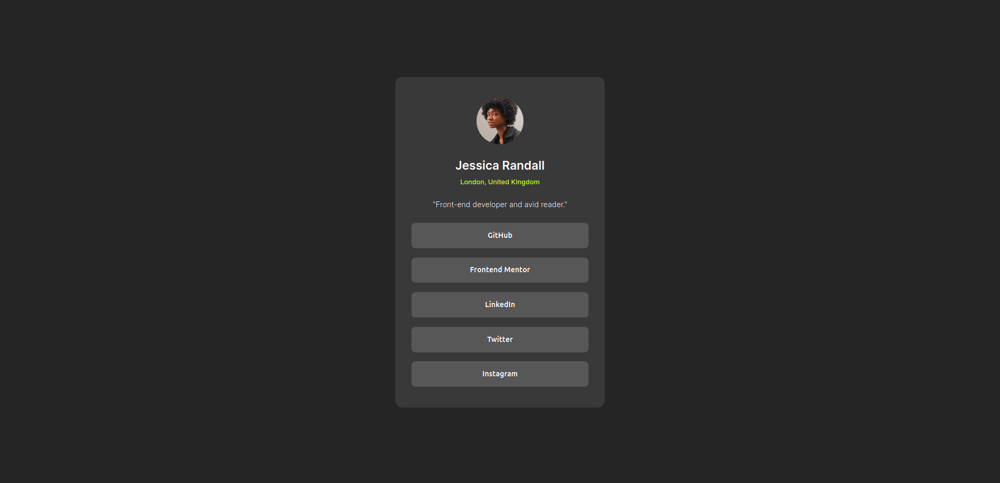

# Frontend Mentors: Social Links 
## Overview
This repository presents an attempt to create the [Frontend Mentor Challenge called "Social Links Profile"](https://www.frontendmentor.io/challenges/social-links-profile-UG32l9m6dQ).  
## Built With
* HTML
* CSS
## Challenges
One of the recurring challenges that I have is getting the `.container` to position itself in the vertical center of the page. 
## Completed Assignment
The completed assignment is posted on Github Pages, [here](https://grimmaldi.github.io/fe-mentors-social-links-profile/).  Here is the image in its current state:

